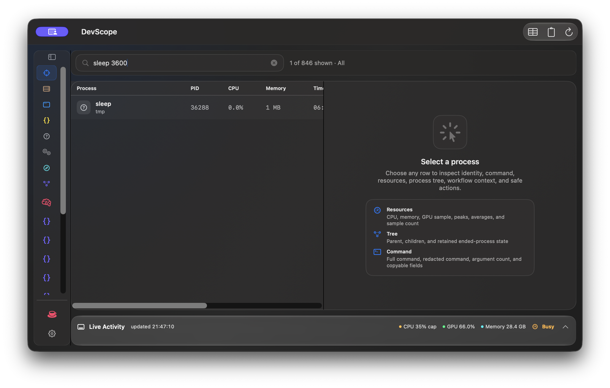

# DevScope

DevScope is a native macOS utility for machine-wide running activity inspection and local process control. It shows apps, browsers, background agents, system services, shell commands, and developer runtimes with enough command context to identify what each app, helper, script, model server, or dev server is doing.

It is built for local-first visibility: no privileged APIs, no cloud service, and no telemetry. Apple Intelligence/Foundation Models are used only when available on-device to improve process names and workflow notes; deterministic scanner facts remain authoritative.

DevScope is licensed under [Apache-2.0](LICENSE). Before contributing or reporting an issue, see [Contributing](CONTRIBUTING.md), [Security](SECURITY.md), [Privacy](PRIVACY.md), and [Support](SUPPORT.md).

Copyright owner: Rafal Sikora. Public maintainer: [RSI Tech](https://rsitech.ai).
Project contact: [info@rsitech.ai](mailto:info@rsitech.ai).



## Status and requirements

DevScope is a pre-1.0 open-source project maintained at
[rsitech-ai/devscope](https://github.com/rsitech-ai/devscope). A downloadable
community prerelease is available, but it is ad-hoc signed and not notarized by
Apple. Source publication, Developer ID distribution, and the reduced
sandbox/App Store path remain separate gates.

- macOS 14 or newer
- A current stable Xcode toolchain with Swift 6 support
- Git and a POSIX-compatible shell

`DevScopeCore` is exposed as a SwiftPM library for app composition and testing.
Its public source API is unstable before 1.0 and may change between minor
releases; the supported end-user product is the `DevScope` macOS app.

## Quickstart

```bash
./script/build_and_run.sh
```

The script builds the SwiftPM app, stages `dist/DevScope.app`, and launches it as a foreground macOS app.

## Download the community preview

Download the latest prerelease and its SHA-256 manifest from
[GitHub Releases](https://github.com/rsitech-ai/devscope/releases). The community
preview is a universal `arm64`/`x86_64` app, but it is **ad-hoc signed and not
notarized by Apple**. macOS Gatekeeper may refuse to open it. Do not disable
Gatekeeper or other macOS security protections; build from source if the preview
is blocked, or wait for a Developer ID signed and notarized release.

Verify the downloaded archive before opening it:

```bash
shasum -a 256 -c DevScope-*.zip.sha256
```

To install the full local process-control app into `/Applications`, use the non-sandbox local installer:

```bash
./script/install_local_full_build.sh
```

Do not use the sandbox smoke bundle as your daily DevScope install. The sandboxed bundle is only for App Store compatibility validation and currently cannot inspect local process metadata.

Install, update, uninstall, and troubleshooting instructions are in
[Installation and maintenance](docs/INSTALLATION.md). DevScope currently has no
in-app updater; updates are explicit source builds or future signed releases.

## Verify

```bash
./script/check_open_source_readiness.sh
swift test
swift build
swift build -c release
./script/build_and_run.sh --verify
./script/sandbox_smoke.sh
```

## Current Features

- Native macOS split layout with a resizable control rail, running activity table, inspector, and bottom system statistics panel.
- Persisted workspace state for the selected scope and collapsed control rail, so the app reopens in the same operating context.
- 2-second live updates for CPU, memory, elapsed runtime, process tree context, and aggregate system graph history, with manual refresh available immediately.
- Dynamic Activity Types generated from the current process snapshot. Known categories include App, Browser, Background Agent, System Service, JavaScript, Python, Swift, Rust, Go, Flutter, Shell, MCP, Database, Container, Web Server, AI, and Other.
- Focus grouping for higher-level workflows such as AI/ML labs, local LLM stacks, training runs, notebook sessions, API/data apps, Flutter builds, web workspaces, and canonical project workspaces.
- Core Apple Intelligence support where available:
  - safer concise process names
  - workflow notes for detected process groups
  - deterministic grouping still controls the final workflow structure
- Sortable running activity table with column headers for process name, PID, CPU, memory, elapsed time, and command.
- Contextual command bar for selected processes with favorite/watch/export/copy/folder actions plus TERM, TERM Tree, and force-kill options.
- Durable copy recovery for the last copied command or export. DevScope writes a bounded recovery cache in Application Support and can restore it after relaunch with `Command-Shift-E`.
- Verified termination feedback: DevScope reports whether TERM/KILL was sent, completed, still pending, or failed.
- Inspector details for command, folder, PID, parent/children/tree counts, workflow context, resource behavior, safe action guidance, and process metric graph.
- Bottom live activity dock with an expanded CPU/GPU/memory graph and a wider machine load card.
- Settings window for Apple naming, process graphs, dynamic process access checks, diagnostics, and the fixed support destination.
- Support flow defaults to [Buy Me a Coffee](https://buymeacoffee.com/s1korrrr).

## Behavior

- The running activity table updates every two seconds with CPU, memory, and elapsed runtime.
- `Refresh` forces an immediate process scan.
- Search filters by command, project hint, kind, executable, or PID.
- Activity categories are detected dynamically from the current process snapshot and only shown when present.
- Focus groups related processes into local development systems such as AI/ML labs, local LLM stacks, training runs, notebook sessions, APIs, data apps, Flutter builds, web workspaces, and project workspaces.
- Sort by CPU, memory, process name, kind, PID, elapsed time, or command through the table headers.
- The detail pane shows command, folder, parent/child process counts, bounded CPU/memory/GPU history, workflow context, resource behavior, and safe action guidance.
- Apple Intelligence is optional. When Foundation Models are available, DevScope can add concise workflow notes and process names; deterministic scanner facts remain authoritative.
- `TERM` sends `SIGTERM` to the selected PID.
- `TERM Tree` sends `SIGTERM` to descendants from the current snapshot before signaling the selected PID.
- Force-kill actions use `SIGKILL` and remain behind a destructive menu.
- Action feedback confirms copied exports, opened folders, favorite/watch changes, and termination outcomes.
- The last copied command/export can be restored from DevScope's local recovery cache if the app is relaunched or the system pasteboard is overwritten.
- Settings control Apple naming, process graphs, access diagnostics, and support actions.
- Settings > Access checks process metadata and working-directory visibility, shows Ready/Needed/Blocked states, and only displays System Settings buttons for actionable permissions such as Full Disk Access.
- Support actions consistently use the fixed Buy Me a Coffee destination.

The app does not use privileged APIs and can only terminate processes allowed by the current macOS user.

## Architecture and API boundary

[Architecture](docs/ARCHITECTURE.md) describes the split between the testable
`DevScopeCore` domain/system layer and the macOS `DevScope` executable. The
library product is not a separately versioned compatibility promise before 1.0.

## Project support

Community support and bug-reporting routes are documented in [SUPPORT.md](SUPPORT.md). If DevScope saves you time, supports your local AI/ML workflow, or helps you clean up long-running apps, services, and dev processes, you can support maintenance here:

[buymeacoffee.com/s1korrrr](https://buymeacoffee.com/s1korrrr)

Settings > Support can open or copy the same trusted Buy Me a Coffee link.

## Distribution notes

The SwiftPM bundle produced by `script/build_and_run.sh` is a local development artifact. It is useful for smoke testing, but it is not an App Store submission or Developer ID release build.

The full local `/Applications` install path is:

```bash
./script/install_local_full_build.sh
```

That build uses the non-sandbox entitlements required for DevScope's local process visibility. If a privacy permission is actually missing, `Settings > Access` can route to the matching macOS System Settings pane.

For sandboxed release validation:

```bash
./script/sandbox_smoke.sh
```

Current Mac App Store status: the sandbox-signed app builds, validates, and launches, but App Sandbox blocks DevScope's shell scanner and the native process fallback returns no visible process records on this machine. The full process-control feature set should not be submitted to the Mac App Store until that blocker is resolved or a reduced App Store variant is intentionally scoped.

The app also exposes this limitation in Settings > Access so users can distinguish privacy permissions from the stronger App Sandbox boundary.

For full-feature public distribution outside the Mac App Store:

```bash
DEVSCOPE_DEVELOPER_ID_SIGN_IDENTITY="Developer ID Application: YOUR NAME (TEAMID)" \
DEVSCOPE_NOTARY_KEYCHAIN_PROFILE="devscope-notary" \
./script/package_developer_id.sh
```

Maintainers can create the explicitly unnotarized community prerelease package
when Apple credentials are unavailable:

```bash
DEVSCOPE_ACKNOWLEDGE_UNNOTARIZED_PREVIEW=1 \
  ./script/package_community_preview.sh
```

That command is for a clearly labeled prerelease only. It is not a substitute
for Developer ID signing, notarization, stapling, or Gatekeeper approval.

For App Store package preparation after installing Apple signing identities and a provisioning profile:

```bash
DEVSCOPE_BUNDLE_ID="com.s1korrrr.DevScope" \
DEVSCOPE_MARKETING_VERSION="0.1.0" \
DEVSCOPE_BUILD_VERSION="1" \
DEVSCOPE_APP_STORE_SIGN_IDENTITY="3rd Party Mac Developer Application: YOUR NAME (TEAMID)" \
DEVSCOPE_INSTALLER_IDENTITY="3rd Party Mac Developer Installer: YOUR NAME (TEAMID)" \
DEVSCOPE_PROVISIONING_PROFILE="/path/to/DevScope.provisionprofile" \
./script/package_app_store.sh
```

Before public release, follow [Maintainer releasing](docs/RELEASING.md) and
complete the [release checklist](docs/RELEASE_CHECKLIST.md). The App
Store-specific notes live in [App Store readiness](docs/APP_STORE_READINESS.md).

Source publication, Developer ID distribution, and Mac App Store distribution are separate gates. The current status and evidence boundaries are recorded in [Open-source status](docs/open-source/OPEN_SOURCE_STATUS.md) and the [publication gate matrix](docs/open-source/PUBLICATION_GATE_MATRIX.md).
